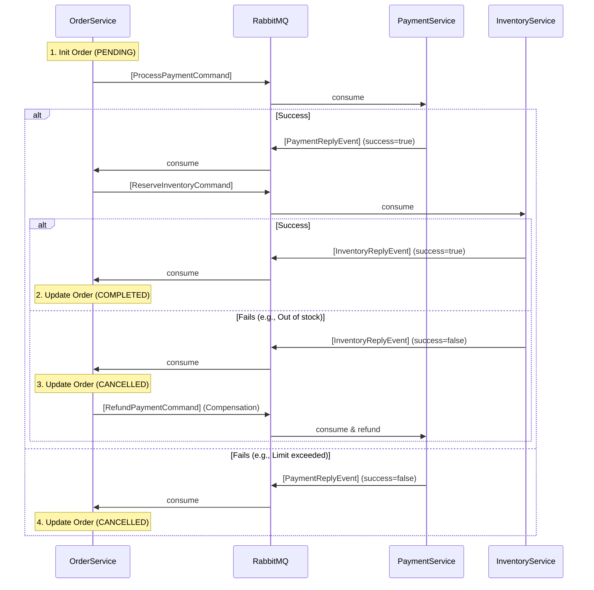

# Spring Saga Orchestration (Event-Driven) - E-Commerce Demo

A microservices e-commerce demonstration implementing the **Saga Orchestration** pattern using **Spring Boot 3.3, Java 21, and RabbitMQ**. This project transitioned from synchronous HTTP communication to a fully asynchronous, event-driven architecture to ensure high availability, decoupling, and robustness.

## Architecture Overview

```text
POST /api/orders
        │ (1. Return 201 Created immediately)
        ▼
  ┌─────────────┐                      [ RabbitMQ ] (saga.exchange)
  │ order-service│ ──────(Commands)─────► │
  │ (Orchestrator)│ ◄─────(Replies)─────── │
  └─────────────┘                          │
                                           ├──► payment.commands Queue ──► [ payment-service ]
                                           │
                                           └──► inventory.commands Queue ──► [ inventory-service ]
```

## Services Portfolio

| Service | Port | Database | Role |
|---------|------|----------|------|
| `order-service` | 8081 | `order_db:5432` | **Saga Orchestrator** - Coordinates the saga via a State Machine stored in DB |
| `payment-service` | 8082 | `payment_db:5433` | **Saga Participant** - Handles payment processing and refunds |
| `inventory-service` | 8083 | `inventory_db:5434` | **Saga Participant** - Handles stock reservation and releasing |
| `rabbitmq` | 5672 | N/A | **Message Broker** - Routes commands and events (15672 for Management UI) |

## Key Features

- ✅ **Asynchronous Orchestration:** Uses RabbitMQ (`TopicExchange`) for non-blocking Command/Reply messaging.
- ✅ **State Persistence:** `order-service` stores the saga state (`SagaState`) in the database to survive crashes.
- ✅ **Automatic Compensation (Rollback):** If inventory fails, the orchestrator issues a `RefundPaymentCommand` to safely rollback the payment step.
- ✅ **Idempotency:** Implemented using `idempotencyKey` across all services to prevent duplicate processing during network retries.
- ✅ **Pessimistic Locking:** Prevents stock overselling under concurrent load in `inventory-service`.

## Quick Start

### 1. Start Infrastructure (PostgreSQL & RabbitMQ)

```bash
docker-compose up -d
```
*Wait a few seconds for RabbitMQ and PostgreSQL to initialize.*

### 2. Run the Microservices

Open 3 separate terminals and run:

```bash
# Terminal 1 - Order Service (Orchestrator)
cd order-service && ./mvnw spring-boot:run

# Terminal 2 - Payment Service
cd payment-service && ./mvnw spring-boot:run

# Terminal 3 - Inventory Service
cd inventory-service && ./mvnw spring-boot:run
```

## API Testing Examples

You can use the provided `api-test.http` file in the root directory to test these endpoints directly from IntelliJ or VS Code.

### 1. Create Order (Happy Path)

Because it's asynchronous, the API returns `201 Created` immediately with a `PENDING` status. The actual saga runs in the background.

```bash
curl -X POST http://localhost:8081/api/orders \
  -H "Content-Type: application/json" \
  -d '{
    "customerId": "CUST-001",
    "productId": "PROD-001",
    "quantity": 2,
    "unitPrice": 999.99,
    "idempotencyKey": "order-key-001"
  }'
```

**Verify completion:** Wait 1 second and check the order status:
```bash
curl http://localhost:8081/api/orders/{orderId}
```
*(Status should be `COMPLETED`)*

### 2. Simulate Payment Failure (Saga fails fast)

*Business Rule: Payments over $10,000 are rejected.*

```bash
curl -X POST http://localhost:8081/api/orders \
  -H "Content-Type: application/json" \
  -d '{
    "customerId": "CUST-001",
    "productId": "PROD-001",
    "quantity": 1,
    "unitPrice": 15000.00,
    "idempotencyKey": "order-key-002"
  }'
```
*(Order will quickly transition to `CANCELLED` and SagaState to `FAILED`)*

### 3. Simulate Inventory Failure (Triggers Compensation/Refund)

*Business Rule: Order an invalid product ID.*

```bash
curl -X POST http://localhost:8081/api/orders \
  -H "Content-Type: application/json" \
  -d '{
    "customerId": "CUST-001",
    "productId": "PROD-NOTEXIST",
    "quantity": 1,
    "unitPrice": 100.00,
    "idempotencyKey": "order-key-003"
  }'
```
**What happens behind the scenes:**
1. Payment succeeds.
2. Inventory fails (product not found).
3. Orchestrator receives failure event.
4. Orchestrator triggers `RefundPaymentCommand`.
5. Order becomes `CANCELLED`.

## Detailed Saga Flow (Event-Driven)



## Default Demo Data

The `inventory-service` auto-seeds three products upon startup:

| ID | Name | Initial Quantity |
|----|------|------------------|
| PROD-001 | Laptop Pro | 100 |
| PROD-002 | Wireless Mouse | 500 |
| PROD-003 | USB-C Hub | 200 |
